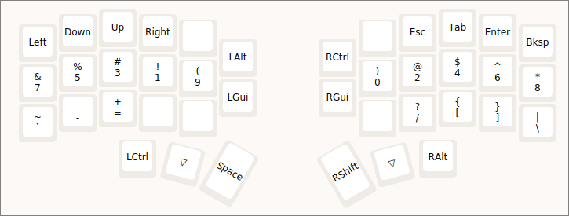

# Dot Files

You can find my [NeoVim dots here](https://github.com/dzh-ma/dot/blob/main/nvim/README.md).

## What I Use

- **OS:** Arch Linux Hyprland
- **Code:** NeoVim
- **Notes:** Neorg
- **Office:** LibreOffice
- **PDF:** Zathura
- **Web:** Google Chrome
- **App/Emoji Picker:** Rofi
- **Terminal:** Ghostty

## Corne Keyboard Layers

